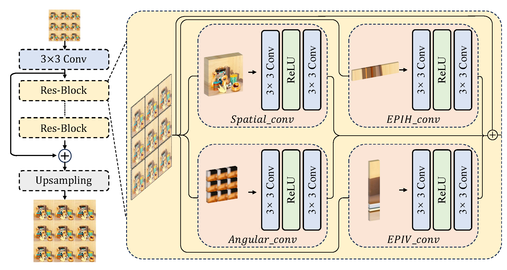
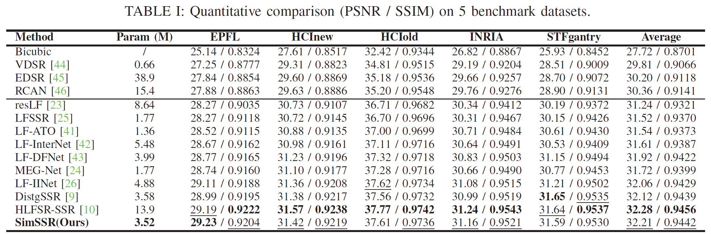
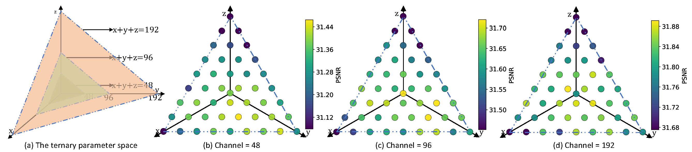
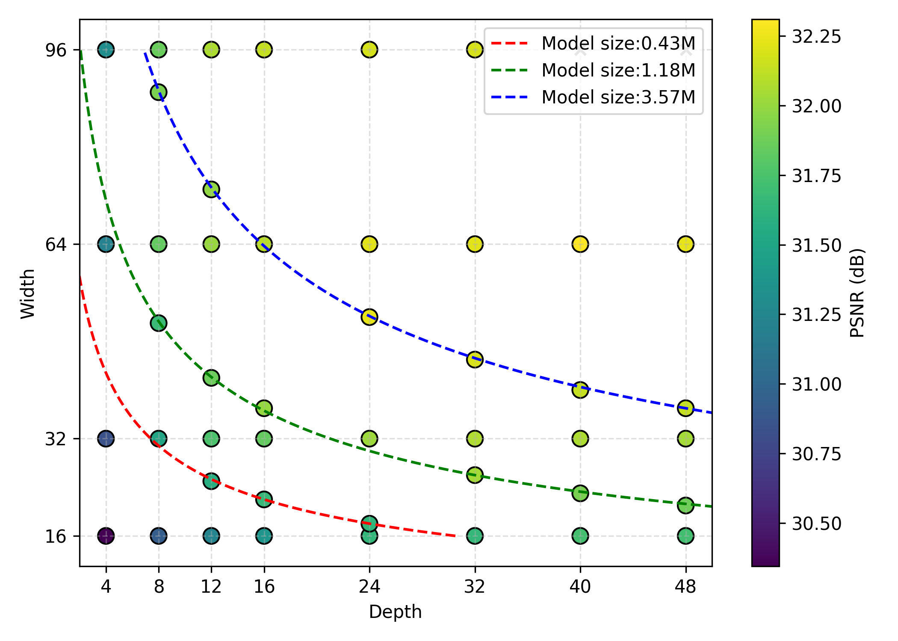

# Revisiting Subspace Disentangling for Light Field Spatial Super-Resolution: A Simple Baseline and An Empirical Study



This is the PyTorch implementation of the spatial SR method in our paper "Revisiting Subspace Disentangling for Light Field Spatial Super-Resolution: A Simple Baseline and An Empirical Study".Please refer to our paper and project page for details.

## Training & Evaluation

- Download the EPFL, HCInew, HCIold, INRIA and STFgantry datasets via [Baidu Drive](https://pan.baidu.com/s/1mYQR6OBXoEKrOk0TjV85Yw) (key:7nzy) or [OneDrive](https://stuxidianeducn-my.sharepoint.com/:f:/g/personal/zyliang_stu_xidian_edu_cn/EpkUehGwOlFIuSSdadq9S4MBEeFkNGPD_DlzkBBmZaV_mA?e=FiUeiv), and place the 5 datasets to the folder **`./datasets/`**.

- Run **`Generate_Data_for_SSR_Training.py`** to generate training data, and begin to train the SimSSR (on 5x5 by default) for 4x SR:

```
  $ python train.py
```

- Run **`Generate_Data_for_SSR_Test.py`** to generate evaluation data, and you can quick run **`test_on_datasets.py`** to perform network inference by using our released models.

## Quantitative Results







The detailed experimental data can be downloaded via this link

## Visual Comparison


## Citiation

If you find this work helpful, please consider citing:

```
@InProceedings{zhang_2025,
    author    = {Zhang, Fengyuan and Wang, Yingqian and Wang, Xueying and Liang, Zhengyu and Wang, Longguang and Tian, Lvli and Yang, Jungang},
    title     = {Revisiting Subspace Disentangling for Light Field Spatial Super-Resolution: A Simple Baseline and An Empirical Study},
    booktitle = {},
    year      = {2025},
}
```

## Related Projects

- [BasicLFSR](https://github.com/ZhengyuLiang24/BasicLFSR)
- [DistgSSR](https://github.com/YingqianWang/DistgSSR)

## Contact

Welcome to raise issues or email to zhangfengyuan24a@nudt.edu.cn for any questions regarding our SimSSR.
