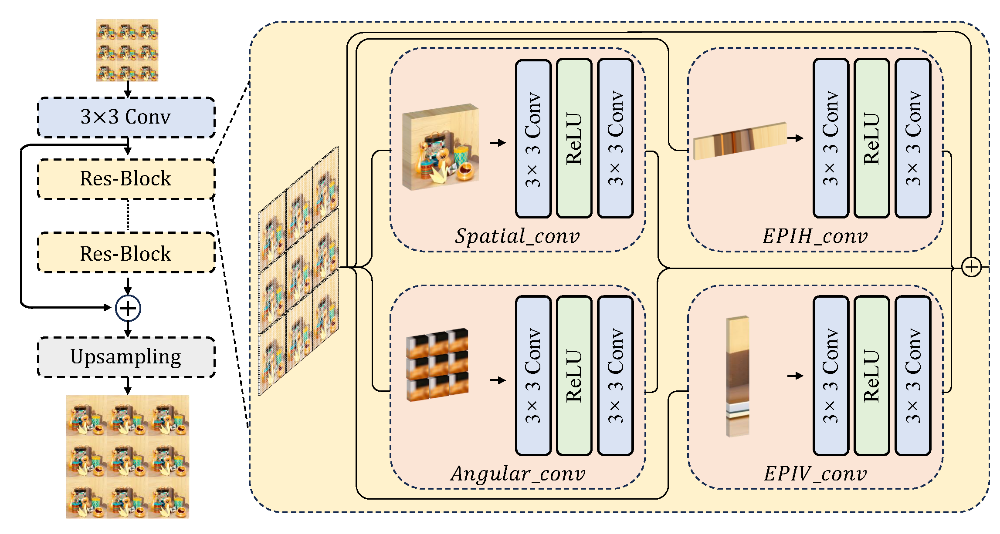
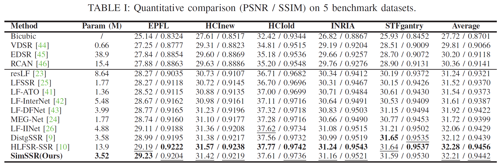
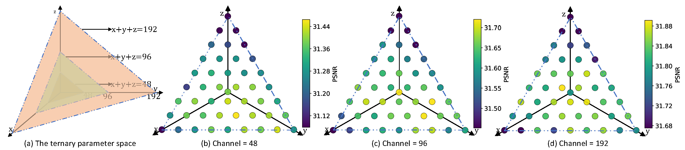
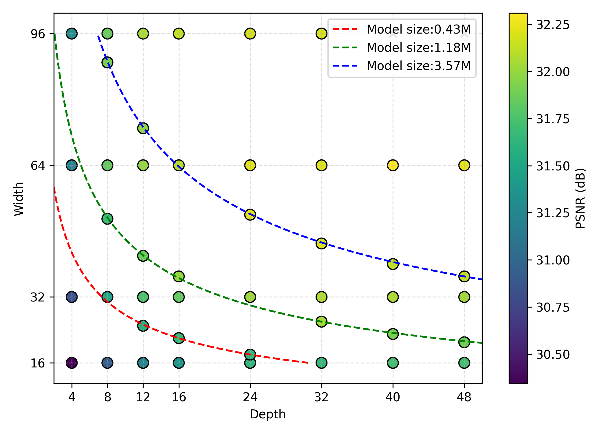
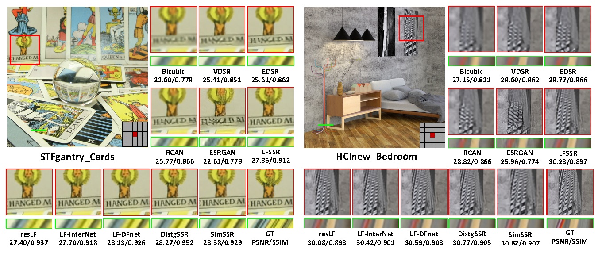

# SimSSR (IEEE TCSVT 2026)

### 📖[**Paper**](https://ieeexplore.ieee.org/document/11372740) | 🖼️[**PDF**](https://ieeexplore.ieee.org/stamp/stamp.jsp?tp=&arnumber=11372740)

PyTorch codes for "[Revisiting Subspace Disentangling for Light Field Spatial Super-Resolution](https://ieeexplore.ieee.org/document/11372740)", **IEEE Transactions on Circuits and Systems for Video Technology (TCSVT)**, 2026.

- Authors: [Fengyuan Zhang](zhangfengyuan24a@nudt.edu.cn), [Yingqian Wang*](https://yingqianwang.github.io/), [Xueying Wang](https://ieeexplore.ieee.org/author/37077731000), [Zhengyu Liang](https://github.com/ZhengyuLeung), [Longguang Wang](https://longguangwang.github.io/),  [Lvli Tian](), and [Jungang Yang]<br>
- National University of Defense Technology and Aviation University of Air Force

### :tada::tada: News :tada::tada:

- The pre-trained SimSSR (×4) was released for a quick test on *Light Field* images! [[Download Pre-trained Model](https://pan.baidu.com/s/10YmiYDr5Xcw7e1gvMY1mhA)](key:nudt)

Abstract:
Light field (LF) spatial super-resolution (SR) aims at reconstructing high-resolution LF images from low-resolution observations. Recently, subspace disentangling has been widely adopted in numerous methods. By decomposing high-dimensional LFdata into spatial, angular and epipolar subspaces, the learning difficulties of deep networks can be significantly reduced. Although achieving continuously improved SR performance, several fundamental issues (e.g., the relative importance of each subspace) remain underexplored, leading to redundant network parameters and high model complexity. In this paper, we revisit this
classical mechanism and conduct an empirical study to investigate these issues. Specifically, we first develop a simple, modular, and scalable LF spatial SR network, based on subspace disentangling. We then conduct extensive experiments to quantitatively evaluate the contributions of each subspace branch, the model scaling property, and the depth-width trade-off. Through comprehensive analyses, the inherent patterns are identified, based on which we derive optimal network designs under varying parameter budgets. Without bells and whistles, our method achieves state-of-the art performance with reduced model size. Code and pretrained
models are available at https://github.com/fyzhang2024/SimSSR/.




This is the PyTorch implementation of the spatial SR method in our paper "Revisiting Subspace Disentangling for Light Field Spatial Super-Resolution: A Simple Baseline and An Empirical Study".Please refer to our paper and project page for details.

## Training & Evaluation

- Download the EPFL, HCInew, HCIold, INRIA and STFgantry datasets via [Baidu Drive](https://pan.baidu.com/s/1mYQR6OBXoEKrOk0TjV85Yw) (key:7nzy) or [OneDrive](https://stuxidianeducn-my.sharepoint.com/:f:/g/personal/zyliang_stu_xidian_edu_cn/EpkUehGwOlFIuSSdadq9S4MBEeFkNGPD_DlzkBBmZaV_mA?e=FiUeiv), and place the 5 datasets to the folder **`./datasets/`**.

- Run **`Generate_Data_for_SSR_Training.py`** to generate training data, and begin to train the SimSSR (on 5x5 by default) for 4x SR:

```
  $ python train.py
```

- Run **`Generate_Data_for_SSR_Test.py`** to generate evaluation data, and you can quick run **`test_on_datasets.py`** to perform network inference by using our released models.

## Quantitative Results







The detailed experimental data can be downloaded via [this link](https://pan.baidu.com/s/10YmiYDr5Xcw7e1gvMY1mhA) (key:nudt) 

## Visual Comparison



## Citiation

If you find this work helpful, please consider citing:

```
@ARTICLE{SimSSR,
  author={Zhang, Fengyuan and Wang, Yingqian and Wang, Xueying and Liang, Zhengyu and Wang, Longguang and Tian, Lvli and Yang, Jungang},
  journal={IEEE Transactions on Circuits and Systems for Video Technology}, 
  title={Revisiting Subspace Disentangling for Light Field Spatial Super-Resolution}, 
  doi={10.1109/TCSVT.2026.3661516}}
```

## Related Projects

- [BasicLFSR](https://github.com/ZhengyuLiang24/BasicLFSR)
- [DistgSSR](https://github.com/YingqianWang/DistgSSR)

## Contact

Welcome to raise issues or email to zhangfengyuan24a@nudt.edu.cn for any questions regarding our SimSSR.
